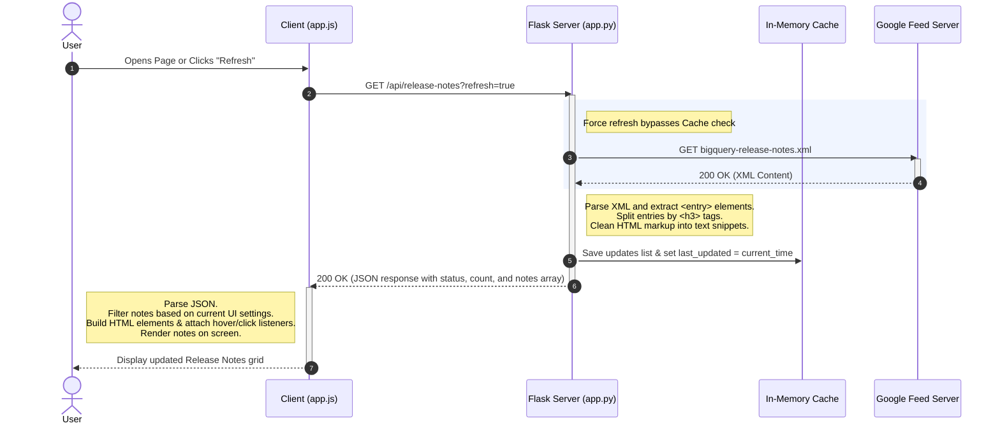

# BigQuery Release Notes Dashboard & Share Tool

A modern, responsive dashboard to monitor, search, and share Google Cloud BigQuery release updates. This application parses the live BigQuery Atom feed, caches updates for speed and efficiency, and includes a built-in X (Twitter) Composer with live previews and text selection sharing.

## 🚀 Key Features

* **Live Feed Syncing & Parsing**: Automatically downloads the official Google BigQuery release notes XML feed, parses namespace data, and splits bulk daily entries by `<h3>` tags into atomic, readable updates.
* **Server-side Cache**: Implements an in-memory server cache (5-minute TTL) to minimize redundant requests to Google's feed servers and accelerate page loads.
* **Interactive UI**:
  * **Dynamic Glow Cards**: Visual grid of release cards featuring mouse-movement-based cursor spotlight glow effects.
  * **Skeletons Loading**: Shimmer placeholder states during async feed fetches.
  * **Instant Filter & Search**: Client-side filtering by update type (Feature, Fix, Issue, Deprecation, General) and instant search.
* **Built-in Tweet Composer**:
  * **Card Sharing**: Easily draft structured tweets for specific updates with pre-populated content.
  * **Selection-to-Tweet**: Select any text block on a card to display a floating "Tweet Selection" button, drafting a tweet with only the highlighted selection.
  * **Live Layout Preview**: Real-time mockup showing how the tweet will look on X/Twitter, complete with a circular character progress bar (280 char limit) and automated entity highlighting (URLs, hashtags, mentions).

---

## 🛠️ Tech Stack

* **Backend**: Python 3, Flask, Requests, XML ElementTree
* **Frontend**: HTML5 (Semantic), Vanilla CSS (Custom properties, grid, gradients, glassmorphism), Vanilla JavaScript (ES6+, Async/Await)

---

## 📂 Project Structure

```text
bigquery_release_notes/
├── app.py                  # Flask main backend application & cache management
├── inspect_feed.py         # Utility script to inspect XML feed namespace structure
├── test_api.py             # Basic API testing script
├── requirements.txt        # Backend dependencies
├── .gitignore              # Ignored files list
├── templates/
│   └── index.html          # Main front-end UI layout template
└── static/
    ├── css/
    │   └── style.css       # Core styling, variables, theme, and animations
    └── js/
        └── app.js          # Core frontend state and user interaction handler
```

---

## 📋 Prerequisites & Installation

### 1. Clone the repository and navigate to the directory
```bash
git clone https://github.com/likithtraveller-ai/antigravity-event-talks-app.git
cd antigravity-event-talks-app
```

### 2. Set up a virtual environment (Recommended)
```bash
python -m venv venv
# On Windows (cmd/powershell):
.\venv\Scripts\activate
# On Linux/macOS:
source venv/bin/activate
```

### 3. Install dependencies
```bash
pip install -r requirements.txt
```

### 4. Run the application
```bash
python app.py
```
Open your browser and navigate to `http://127.0.0.1:5000`.

---

## 🔄 Request-Response Flow


